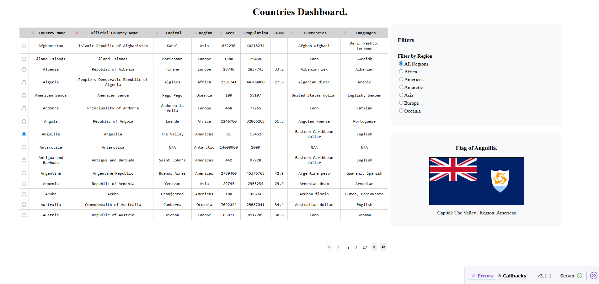

# Junior Data Engineer Test Assignment
#### Nikita Ovchinnikov
##### 29.07.2025
---
The purpose of the project is to demonstrate a simple ETL pipeline, with REST API, data normalization, storage data in PostgreSQL inside a Docker container, and simple visialization by Dash.


---

## Project's file structure:
```
.
├── docker
│ └── docker-compose.yml        # PostgreSQL container setup
├── etl
│ └── etl.py                    # Extract, Transform, and Load data into DB
├── visualization
│ └── visualization.py          # Dash app to display countries table and flags
├── airflow
│   └── dags
│       └── etl_dag.py          # Sample Airflow DAG for ETL automation
├── requirements.txt            # Python dependencies
├── Junior_DE_test_task.ipynb   # Jupyter notebook with all initial code (optional)
├── dashboard_screenshot.png
└── README.md                   # Instructions and explanations
```
---

## Database Setup

### 1. Clone the Repository
```bash
git clone https://your-username/junior_data_engineer_task.git
cd junior_data_engineer_task
```

### 2. Start PostgreSQL via Docker:

```bash
docker-compose up -d
```
Wait until the PostgreSQL container is healthy. It runs on localhost: 5432.

### 3. Set up python requiremens

```bash
pip install -r requirements.txt
```

### 4. Run ETL script (etl.py)
```bash
python .\etl\etl.py
```
If it worked correctly, you'll have 5 normalized tables in PostgreSQL and a materialized view data mart (countries_summary) for a dashboard visualization.
The pipeline:
- #### Extract:
    - Data for countries, limited to 10 selected fields including names, population, flags, capital, region, area, currencies, and languages, requested from the API.
    - The API returns a nested JSON, that isshould be normalized into flat tables.
- #### Transform:
    - Data is normalized using Star Schema for more flexibility:
        - countries (fact table)
        - currencies, languages (dimension tables)
        - countries_currencies, countries_languages (many-to-many junction tables)
- #### Loads into DB with:
    - Explicit column types
    - Many-to-many relationships handled via junction tables
    - Tables are created with ```pandas.to_sql()``` with following manual tuning

#### Integrity via constaints
- After inserting data, I used ```ALTER TABLE``` for:
    - Add Primary Keys
    - Add Foreign Keys
    - Add Cheks for:
        - area > 0
        - population >= 0
        - 0 <= gini <= 100

#### Performance via indexes
- For quering optimization I added indexes on:
    - regions - faster filtering by regions
    - population - faster sort by population

#### Data Mart
- A database VIEW, joined and aggregated all normalized tables in a flat structure for a visualization
- Rename columns into more representable form
- Handles NULL values


### 5. Launch the Dash App (visualization.py)
```bash
python .\visualization\visualization.py
```

It runs on a local server:
```
http://127.0.0.1:8050
```


---

### 6. Bonus automation

As a bonus, I included a sample DAG (etl_dag.py) script to demostrate how this ETL process can be automated using Apache Airflow.
I set an ETL schedule with a 12-hours interval.

---
#### Contact
```
nick.ovchinnikov.biz@gmail.com | +381628782746 | @ns_ovchinnikov
```
Please feel free to reach out if you have any questions.
